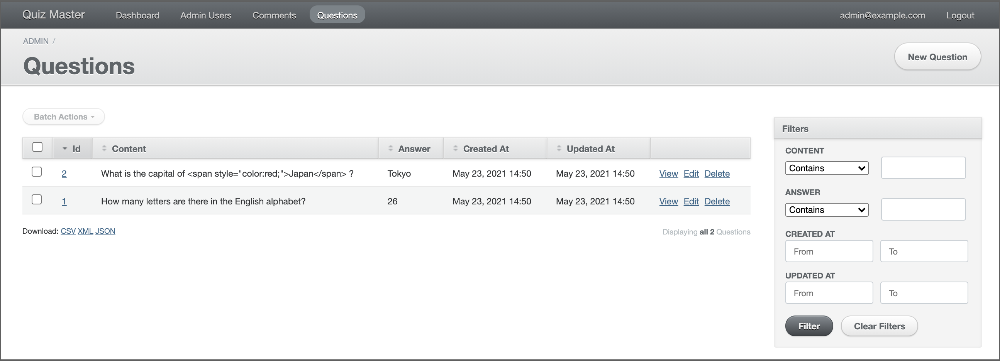
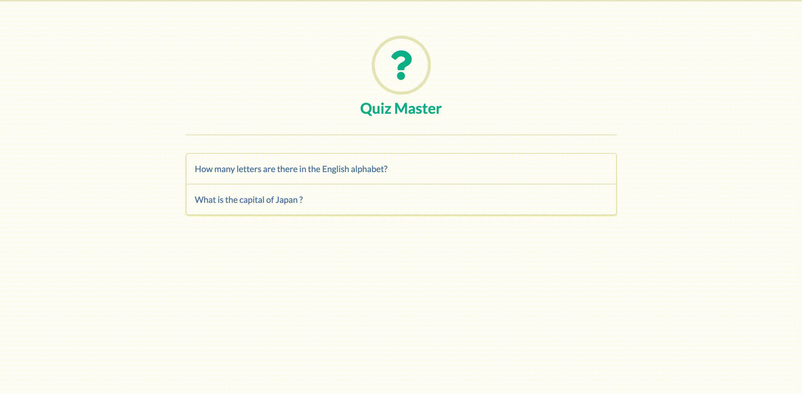

# Quiz Master

Quiz Master allows users to create test questions and answers.

- [Quiz Master](#quiz-master)
  - [Getting started](#getting-started)
  - [Managing quizzes](#managing-quizzes)
  - [Playing quizzes](#playing-quizzes)
  - [Testing](#testing)
    - [Back-end](#back-end)
    - [Front-end](#front-end)
  - [Author](#author)

## Getting started

This project uses docker containers and they bind 3000 and 3001 ports to your machine.
```
$ git clone git@github.com:alpaca0984/QuizMaster.git
$ cd QuizMaster
$ docker compose build
$ docker compose run --rm app bundle exec rails db:create db:migrate db:seed
$ docker compose up
```
Now, you can access `localhost:3001/admin/` to manage quizzes and `localhost:3000` to play them.

## Managing quizzes

When you access to http://localhost:3001/admin/ , a login page appears. Default user's account is here.
- Email: `admin@example.com`
- Password: `password`

After login, click `Questions` tab on header, and you can make CRUD operations for questions.



You can provide formatting or styling for the question content with some HTML tags and `style` attribute.
I prepared an example in [db/seeds.rb](https://github.com/alpaca0984/QuizMaster/blob/master/db/seeds.rb#L14).

## Playing quizzes

When you access to http://localhost:3000/ , all questions appear. Click them and you can show it and submit an answer. In cases wherein the answer is/contains a number, it should recognize the number as words.

Example: __Q: How many vowels are there in the English alphabet? A: 5__

| Given answer                                               |           |
|------------------------------------------------------------|-----------|
| Answer by user on Quiz mode: 5                             | CORRECT   |
| Answer by user on Quiz mode: five                          | CORRECT   |
| Answer by user on Quiz mode: 6                             | INCORRECT |
| Answer by user on Quiz mode: six                           | INCORRECT |



## Testing

### Back-end

This script tests how Question model validates input data and checks given answers.
```
$ docker compose run --rm app bundle exec rspec spec/models
```

### Front-end

Using jest and enzyme to tests if components are rendered normally.
```
$ docker compose run --rm app npm --prefix client test
```

## Author

Masataka Hirano - [alpaca0984](https://github.com/alpaca0984)
